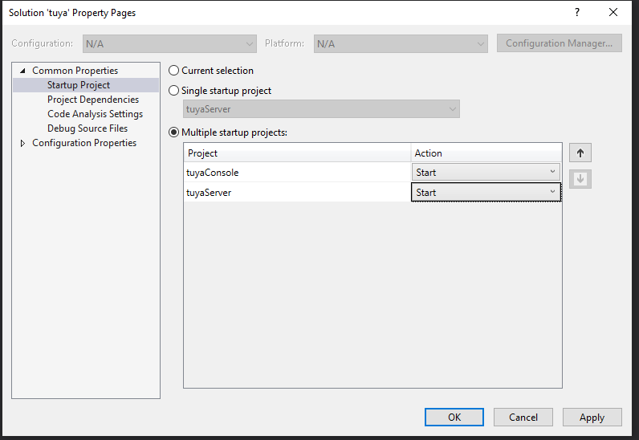
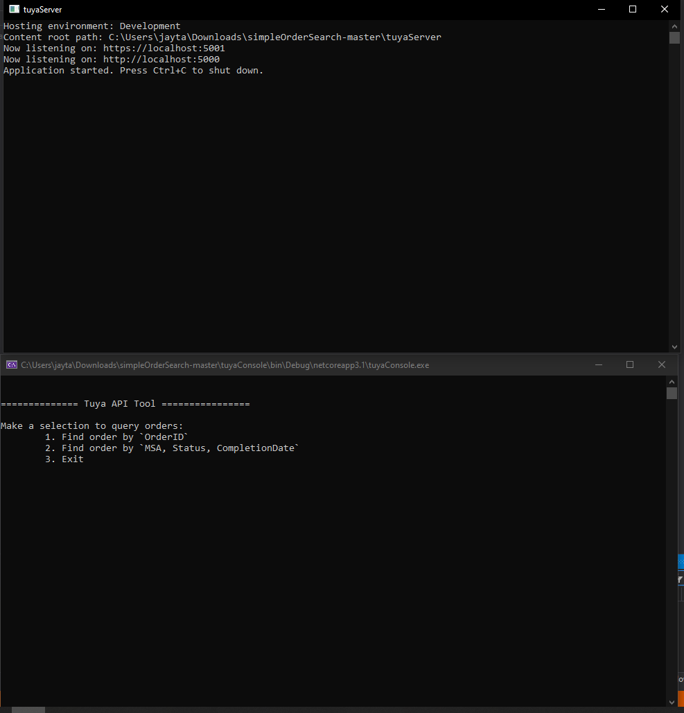
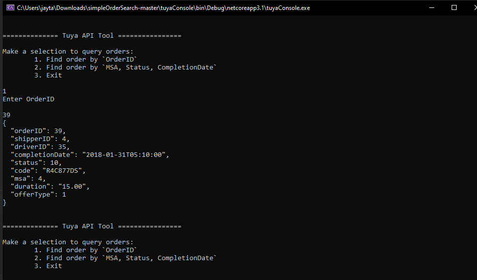
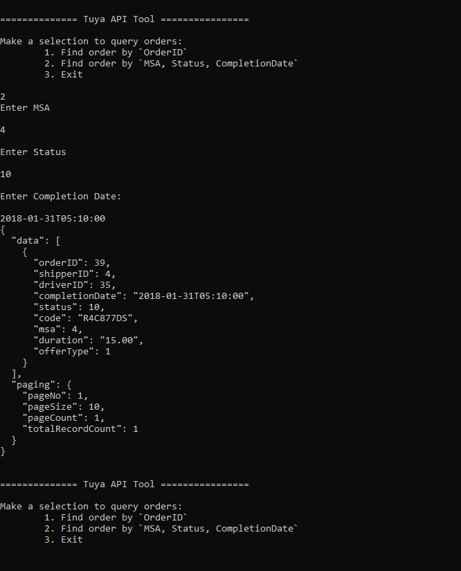

# Instructions

- Open Visual Studio or any other IDE
- Open the solution `tuya.sln`
- Once the project is loaded, edit the `Solution Properties`
- Now Select `Common Properties` -> `Startup Project` -> `Multiple startup projects`

- On both projects select `Start`
- Now save the settings and Start the project.

# Example Screen Shots

> I downloaded my own sourcecode to verify everything was working and took screen shots

